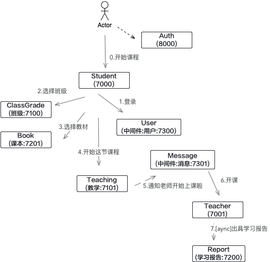

# school
在使用前已经假设你已经搭建了k8s环境、并且了解如何使用它, istio环境搭建可以参考官方文档.
这个项目里构建微服务是用来测试 istio 的流量已经 jwt 认证功能

## 简单的构建微服务流程图

## 本地构建环境依赖
    1.必须已经在本地安装了 java 、maven 、 docker、 redis 
    2.创建两个不同版本的teaching, 分别为不同的deployment 添加标签 version:v1 version:latest
    3.添加本地域名解析项 10.211.55.6     istio-test.com

## 测试
    1.  curl -v 'http://istio-test.com:32582/auth/token?clientId=test'
    2.  curl -v -H 'Authorization: Bearer jwt-token' 'http://istio-test.com:32582/class/begin?username=xiaoming&classGrade=2&bookNo=math'

### jwt token校验
    https://jwt.io/
       
### 参考
    1.https://www.servicemesher.com/istio-handbook/practice/route.html
    2.https://istio.io/latest/zh/docs/tasks/traffic-management/ingress/ingress-control/
    